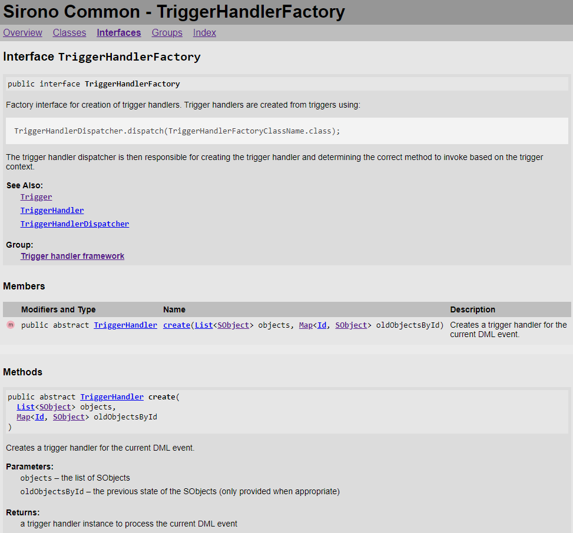

# IcApexDoc

An API documentation generator for Salesforce Apex types and triggers and custom SObjects and fields.

* [Overview](#overview)
* [Features](#features)
* [Syntax](#syntax)
* [Installation](#installation)
* [Usage](#usage)
* [License](#license)
* [Release Notes](RELEASE-NOTES.md)

## Overview

**IcApexDoc** is a command-line tool for generation of HTML-based documentation from Salesforce source code and metadata, specifically **Apex types and triggers** and **custom object and field metadata** files. Apex type and trigger documentation is derived from declaration signatures and **ApexDoc**-based documentation comments.

**ApexDoc** is a simple markup language embedded within Apex documentation comments (`/** ... */`) and is very similar to comment-based documentation tools for other languages such as [**JavaDoc**](https://www.oracle.com/technical-resources/articles/java/javadoc-tool.html) and [**JSDoc**](https://jsdoc.app/).

There are several other implementations of ApexDoc including:

* [**ApexDoc**](https://github.com/SalesforceFoundation/ApexDoc) - the original implementation from Salesforce Foundation; doesn't seem to be maintained any longer
* [**SfApexDoc**](https://lucidwaresolutions.com/sfapexdoc/) - A derivative of ApexDoc with support for additional tags and features; doesn't seem to be maintained any longer
* [**ApexDocs**](https://www.npmjs.com/package/@cparra/apexdocs) - A Node.js library and tool that further extends the available tags and markup features

IcApexDoc is based on [**Illuminated Cloud 2**](https://www.illuminatedcloud.com/)'s ApexDoc parser and HTML generator used to support its [ApexDoc authoring features](https://www.youtube.com/watch?v=j67equfpdRo). However, while Illuminated Cloud 2 is a **commercial product**, IcApexDoc is [**completely free to use**](#license) and is planned for an eventual (hopefully soon) **open source release**.

## Features

Documentation generated by IcApexDoc shows extensive details for all declarations found by the [command-line usage](#usage) including hyperlinking for declaration types in signatures, explicit references in ApexDoc markup, and even links to Salesforce's Web-based documentation for **system Apex types** and **standard SObjects**.

The resulting documentation includes a primary landing page called **Overview** (corresponding to the generated file `index.html`) that lists all Apex types and triggers and all custom SObjects found in the project source and metadata files. Additionally other tabs are generated for each type of declaration, i.e., **Classes**, **Enums**, **Interfaces**, **Triggers**, and **SObjects**, to facilitate more focused cross-sections of the project.


Clicking on a type, trigger, or SObject link navigates to the specific page for that declaration which includes more header-level details for the top-level declaration as well as a list of all visible contained members. Members are listed together in a summary view but are also included in more detail below, broken out by declaration type, i.e., **Constructors**, **Fields**, **Properties**, and **Methods**.



Documentation for each generated declaration is based on its unique signature, i.e., annotations, modifiers, type, name, parameters, and bidirectional inheritance relationships, as well as the user-defined documentation. For Apex declarations, the user-defined documentation is based on an [ApexDoc documentation comment](#syntax) immediately preceding the declaration itself; for SObjects and their fields, the user-defined documentation is based on the `description` and `label` elements found in the corresponding metadata XML files.

## Syntax

ApexDoc comments are Apex block comments found immediately preceding any Apex top-level or body declaration that begin with `/**` (note two stars instead of just the one required to begin a normal block comment), e.g.:

```apex
/**
 * Common interface for two-dimensional closed shapes.
 */
public interface Shape {
    /**
     * Computes the shape perimeter.
     * 
     * @return the perimeter
     */
    Double getPerimeter();
}
```

ApexDoc comments can use the following to provide additional information and formatting:

* **HTML markup** - HTML markup can be used directly within ApexDoc comments. Note that this means that **HTML escaping rules** also apply to ApexDoc comments, e.g., use HTML entities as required. It is recommended that HTML markup in ApexDoc comments be kept **simple** to ensure that they render well in tools such as IDEs which may use simpler HTML rendering engines.
* [**ApexDoc tags**](#apexdoc-tags) - Like JavaDoc, JSDoc, etc., ApexDoc supports a number of tags of the form `@tag [<params>]` that specify information about the documented declaration.
* [**ApexDoc macros**](#apexdoc-macros) - ApexDoc also supports a number of simple macros to simplify declaration cross-referencing and even code/preformatted blocks.

### ApexDoc tags

The following ApexDoc tags are supported:

* `@author <value>` - Specifies author information.
* `@date <value>` - Specifies date information.
* `@deprecated [<description>]` - Denotes the declaration as deprecated with optional information about the deprecation such as a suggested alternative; note that this is different from the [`@Deprecated` Apex annotation](https://developer.salesforce.com/docs/atlas.en-us.apexcode.meta/apexcode/apex_classes_annotation_deprecated.htm) which can only be applied to `global` symbols in released managed packages while the ApexDoc tag can be applied to any declaration to communicate that it should no longer be used.
* `@description <description>` - Specifies a description for the documented declaration. Note that this tag is **optional** (and discouraged) in IcApexDoc. If not present, all text before the first ApexDoc tag will be used as the description for the documented declaration.
* `@example <example>` - Provides an example usage of the documented declaration. The example is automatically formatted as code.
* `@exception`/`@throws <exceptionTypeName> [<description>]` - Documents an exception that is thrown by the method or constructor with an optional description of the conditions under which it's thrown. **NOTE:** IcApexDoc accepts both `@exception` and `@throws` for the list of thrown exceptions.
* `@group <groupName>` - Provides a name that can be used to group common declarations together. **NOTE:** As a **future enhancement**, IcApexDoc may add a **Groups** tab to the page navigation bar where all used groups are displayed and, upon selection, all declarations for that group are listed.
* `@group-content <filePath>` - Provides the path to a file that should be used when displaying all declarations for the `@group` value. **NOTE:** IcApexDoc currently consumes this as a valid tag but does not include it in the generated output. The same enhancement described above for `@group` would use this to create the group page content.
* `@param <paramName> [<paramDescription>]` - Describes the respective formal parameter of the documented constructor or method. `@param` tags should be listed in the same order as the respective formal parameters.
* `@return`/`@returns <description>` - Describes the value(s) returned by the documented method. **NOTE:** The preferred form is `@return` but both are supported by IcApexDoc.
* `@see <typeName>[.<memberName>] [<description>]` - Adds a reference to a related type or member with an optional description of the relationship.
* `@since <value>` - Specifies a version, date, etc., from which the documented declaration should be considered available.

### ApexDoc macros

The following ApexDoc macros are supported:

* `{@link <reference>}` - Creates a link to the specified type or member.
* `<<reference>>` - Creates a link to the specified type or member. **NOTE:** This macro is specifically `<<...>>`; the angle brackets do not frame a variable.
* `{@code <code>}` - Formats the text as code.
* <code>\`&lt;code&gt;\`</code> - Formats the text between backticks as code.

References can be specified as:
* `<typeName>`
* `<typeName>.<memberName>`
* `<typeName>#<memberName>`
* `#<memberName>`

**NOTE:** Currently references to specific method signatures are not supported. The hyperlink will navigate to the first method signature with the specified name.

## Installation

You can install IcApexDoc by downloading the latest released `IcApexDoc.zip` archive from the **Releases** sidebar, extracting it into your local filesystem, and adding `<extractedDirectory>/bin` to your operating system's execution path. You should then be able to run `apexdoc` from the command-line successfully.

Note that you **must** also have a **Java 11+ runtime environment** installed with the `java` executable also available in the operating system's execution path such that you are able to run `java` from the command-line successfully.

## Usage

The command-line usage is as follows:

```text
usage: apexdoc <options>
 -p,--sfdx-project <arg>   sfdx-project.json file
 -s,--source <arg>         input source directory
 -x,--exclude <arg>        exclude directory
 -o,--output <arg>         output directory
 -v,--visibility <arg>     minimum visibility for included declarations;
                           one of private, protected, public, or global
                           (default protected)
 -t,--title <arg>          window title
 -f,--overview <arg>       overview HTML file
 -c,--css <arg>            custom stylesheet file
 -h,--help                 show usage details
 -version,--version        show version information
```

## Input

### Source format projects

In a source format (i.e., Salesforce DX) project, it is likely most convenient to use the `-p/--sfdx-project` argument to specify the path to the project's `sfdx-project.json` file. IcApexDoc will then use the file's configured package directories as the source directories to be scanned for Apex and custom object source files.

```text
apexdoc -p sfdx-project.json -o apexdoc
```

### Metadata format projects

In a metadata format (i.e., pre-Salesforce DX) project, source directories must be specified explicitly using the `-s/--source` argument:

```text
apexdoc -s src -s test -o apexdoc
```

### Exclusion

It can also be useful to specify sub-directories of source directories which should be excluded from the scan using the `-x/--exclude` argument:

```text
apexdoc -p sfdx-project.json -x dlrs/libs/metadataservice -o apexdoc
```

## Output

You must specify the output directory path in which documentation will be generated using the `-o/--output` argument:

```text
apexdoc -p sfdx-project.json -o apexdoc
```

### Visibility filtering

You can specify the minimum visibility of declarations to be included in the generated documentation using the `-v/--visibility` argument. If unspecified, the minimum visibility for included declarations is `protected`. For ISVs, it can be useful to generate internal documentation using the default minimum visibility and customer-facing documentation that includes only the `global` interface of published packages, e.g.:

```text
apexdoc -p sfdx-project.json -o apexdoc -v global
```

### Project title

You can specify the title of the project explicitly using the `-t/--title` argument. If unspecified and an `sfdx-project.json` file containing a `name` property is specified, that value is used as the project title. Otherwise the default value of `ApexDoc` is used.

### Overview content

You can specify the path to an HTML file that should be included in the **Overview** landing page to provide a high-level description of the project's contents using the `-f/--overview` argument:

```text
apexdoc -p sfdx-project.json -o apexdoc -f myProject.html
```

The HTML content should **not** include the `<html>`, `<head>`, or  `<body>` tags.

### Stylesheet

You can specify the path to a CSS file that should be used to style the generated documentation using the `-c/-css` argument. The `default.css` file that is included if this argument is unspecified should be used for reference when creating a custom stylesheet.

## License

IcApexDoc is 100% free to use under the [**Apache 2.0 License**](https://www.apache.org/licenses/LICENSE-2.0). Note that while portions of IcApexDoc have been derived from [**Illuminated Cloud 2**](https://www.illuminatedcloud.com/), that product&mdash;and its predecessor [**Illuminated Cloud 1**](https://www.illuminatedcloud.com/purchase/illuminated-cloud-1)&mdash;are **commercial products** offered under their own legal [**Terms and Conditions**](https://www.illuminatedcloud.com/purchase/terms-and-conditions). Access to or usage of IcApexDoc does not **in any way** entitle the user to a license for either Illuminated Cloud 2 or Illuminated Cloud 1.