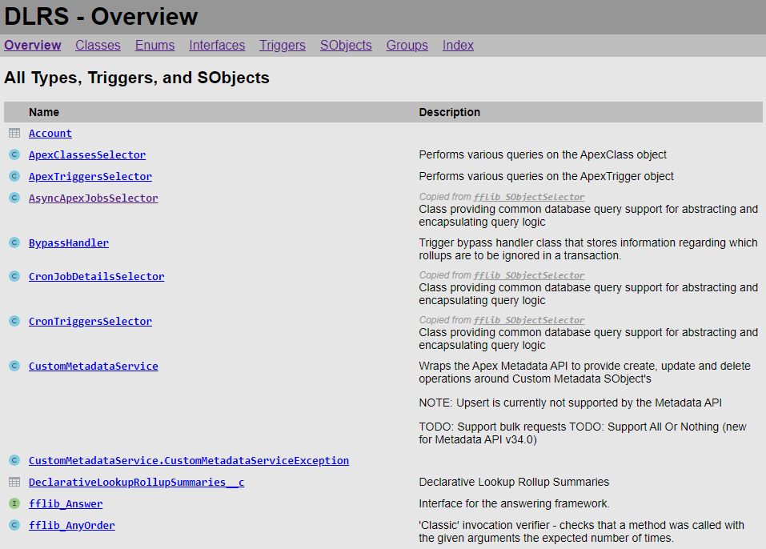

# IcApexDoc

An API documentation generator for Salesforce Apex types and triggers and custom SObjects and fields.

* [Overview](#overview)
* [Features](#features)
* [Syntax](#syntax)
* [Installation](#installation)
* [Usage](#usage)
* [Validation](#validation)
* [Troubleshooting](#troubleshooting)
* [License](#license)
* [Release Notes](RELEASE-NOTES.md)

## Overview

**IcApexDoc** is a command-line tool for generation of HTML-based documentation from Salesforce source code and metadata, specifically **Apex types and triggers** and **custom object and field metadata** files. Apex type and trigger documentation is derived from declaration signatures and **ApexDoc**-based documentation comments.

**ApexDoc** is a simple markup language embedded within Apex documentation comments (`/** ... */`) and is very similar to comment-based documentation tools for other languages such as [**JavaDoc**](https://www.oracle.com/technical-resources/articles/java/javadoc-tool.html) and [**JSDoc**](https://jsdoc.app/).

There are several other implementations of ApexDoc including:

* [**ApexDoc**](https://github.com/SalesforceFoundation/ApexDoc) - the original implementation from Salesforce Foundation; doesn't seem to be maintained any longer
* [**SfApexDoc**](https://lucidwaresolutions.com/sfapexdoc/) - A derivative of ApexDoc with support for additional tags and features; doesn't seem to be maintained any longer
* [**ApexDocs**](https://www.npmjs.com/package/@cparra/apexdocs) - A Node.js library and tool that further extends the available tags and markup features

Additionally, Salesforce has recently (as of late 2025) published a [specification](https://developer.salesforce.com/docs/atlas.en-us.258.0.apexcode.meta/apexcode/apex_doc_format.htm) for ApexDoc that will become the standard. IcApexDoc provides full support for that specification via a [strict mode](#strict-mode) option for its [validation features](#validation).

IcApexDoc is based on [**Illuminated Cloud 2**](https://www.illuminatedcloud.com/)'s ApexDoc parser and HTML generator used to support its [ApexDoc authoring features](https://www.youtube.com/watch?v=j67equfpdRo). However, while Illuminated Cloud 2 is a **commercial product**, IcApexDoc is [**completely free to use**](#license) and is planned for an eventual (hopefully soon) **open source release**.

## Features

Documentation generated by IcApexDoc shows extensive details for all declarations found by the [command-line usage](#usage) including hyperlinking for declaration types in signatures, explicit references in ApexDoc markup, and even links to Salesforce's Web-based documentation for **system Apex types** and **standard SObjects**.

The resulting documentation includes a primary landing page called **Overview** (corresponding to the generated file `index.html`) that lists all Apex types and triggers and all custom SObjects found in the project source and metadata files. Additionally other tabs are generated for each type of declaration, i.e., **Classes**, **Enums**, **Interfaces**, **Triggers**, and **SObjects**, to facilitate more focused cross-sections of the project.



Clicking on a type, trigger, or SObject link navigates to the specific page for that declaration which includes more header-level details for the top-level declaration as well as a list of all visible contained members. Members are listed together in a summary view but are also included in more detail below, broken out by declaration type, i.e., **Constructors**, **Fields**, **Properties**, and **Methods**.


 
A **Groups** tab is added (corresponding to the generated file `groups.html`) for all [`@group` ApexDoc tag](#apexdoc-tags) values found in type or trigger declarations with descriptions for each group optionally derived from [group content files](#group-content-files) and links to all members of each respective group.


Finally, an **Index** tab is added (corresponding to the generated file `index-all.html`) with all declarations partitioned by the first character of the unqualified declaration name to provide efficient access to the documentation for class constants, utility methods, SObject fields, etc., by simple name.


Documentation for each generated declaration is based on its unique signature, i.e., annotations, modifiers, type, name, parameters, and bidirectional inheritance relationships, as well as the user-defined documentation. For Apex declarations, the user-defined documentation is based on an [ApexDoc documentation comment](#syntax) immediately preceding the declaration itself; for SObjects and their fields, the user-defined documentation is based on the `description` and `label` elements found in the corresponding metadata XML files.

## Syntax

ApexDoc comments are Apex block comments found immediately preceding any Apex top-level or body declaration that begin with `/**` (note two stars instead of just the one required to begin a normal block comment), e.g.:

```apex
/**
 * Common interface for two-dimensional closed shapes.
 */
public interface Shape {
    /**
     * Computes the shape perimeter.
     * 
     * @return the perimeter
     */
    Double getPerimeter();
}
```

ApexDoc comments can use the following to provide additional information and formatting:

* **HTML markup** - HTML markup can be used directly within ApexDoc comments. Note that this means that **HTML escaping rules** also apply to ApexDoc comments, e.g., use HTML entities as required. It is recommended that HTML markup in ApexDoc comments be kept **simple** to ensure that they render well in tools such as IDEs which may use simpler HTML rendering engines.
* [**Markdown**](#markdown-support) - Unless [strict mode](#strict-mode) is enabled, simple Markdown syntax can be used directly within ApexDoc comments and overview file contents. Hopefully in the near future Salesforce's ApexDoc specification will be amended to support Markdown-based formatting as that has become the de facto standard for technical documentation.
* [**ApexDoc tags**](#apexdoc-tags) - Like JavaDoc, JSDoc, etc., ApexDoc supports a number of tags of the form `@tag [<params>]` that specify information about the documented declaration.
* [**ApexDoc macros**](#apexdoc-macros) - ApexDoc also supports a number of simple macros to simplify declaration cross-referencing and even code/preformatted blocks.

### Markdown support

Unless [strict mode](#strict-mode) is enabled, IcApexDoc supports a subset of [Markdown syntax](https://www.markdownguide.org/basic-syntax/) for formatting of ApexDoc comments and [overview file contents](#overview-content). The following Markdown features are supported:

* **Bold** - `**text**` or `__text__`
* *Italic* - `*text*` or `_text_`
* ~~Strikethrough~~ - `~~text~~`
* ``Code`` - `` `code` `` or ``` `` `codeWithBackticks` `` ``` (also see **Fenced code blocks** below)
* **_~~Composition~~_** - The mechanisms above can be used in composition to style text as desired with the following limitations:
  * `**bold**`/`*italic*` and `__bold__`/`_italic_` cannot be used in immediate composition with one another; use `**bold**`/`_italic_` or `__bold__`/`*italic*` instead.
  * `` `code` `` must be the **innermost** applied style as it renders its contents exactly.
* **Heading text** - `#` (`h1`) to `######` (`h6`) followed by heading text, e.g.:
  ```markdown
  # Heading 1
  ## Heading 2
  ### Heading 3
  #### Heading 4
  ##### Heading 5
  ###### Heading 6
  ```
* **Block quotes**
  ```markdown
  > line1
  > line2
  > ...
  ```
* **Fenced code blocks**
  ````markdown
  ```language
  line1
  line2
  ...
  ```
  ````
  * The `language` is optional. When provided, language-specific syntax highlighting is implemented using [highlight.js](https://highlightjs.org/), and a value of `apex` automatically acts as a synonym for `java`. I may contribute an Apex-specific grammar to that project so that the language is handled in a first-class manner with syntax highlighting of Apex-specific keywords, etc.
  * Additional balanced backticks can be used to allow rendering of fenced code blocks within a fenced code block, e.g.:
    `````markdown
    ````markdown
    ```language
    line1
    line2
    ...
    ```
    ````
    `````
* **Images** - ``
* **Hyperlinks** - `[link text](url)`
  * Hyperlinks can be references to Apex types and their members using the same reference syntax as in the `{@link <reference>}` and `<<reference>>` [macros](#apexdoc-macros).
* **Horizontal rules** - `---` (three or more dashes) on a separate line
* **Tables**
  ```markdown
  | Header 1 | Header 2 | Header 3 |
  | -------- | -------- | -------- |
  | Data 1.1 | Data 1.2 | Data 1.3 |
  | Data 2.1 | Data 2.2 | Data 2.3 |
  ```
  * Table cell delimiters (`|`) can be included in table cells by escaping them (`\|`) or including them in code blocks (`` `A|B` ``).
  * Multi-line cell data can be provided by using HTML markup that results in multiple lines, e.g., `<br/>` or `<p/>` tags, raw HTML ordered/unordered lists, etc., all on the same line.
* **Ordered lists**
  ```markdown
  1. list item 1
  2. list item 2
     with multiple lines
  3. list item 3
  ```
  The numbers used to begin items are unimportant, and `1.` can be used pervasively to avoid having to renumber as items are inserted and removed. List items can span multiple lines, but continuation lines must be indented at least one space more than the line that begins the list item.
* **Unordered lists**
  ```markdown
  * list item 1
  * list item 2
    with multiple lines
  * list item 3
  ```
  List items may begin with `*`, `+`, or `-`. List items can span multiple lines, but continuation lines must be indented at least one space more than the line that begins the list item.
* **Ordered/unordered list nesting** - List items indented relative to the immediate proceeding list item start a nested list of the specified type, e.g.:
  ```markdown
  * unordered list item 1
    - unordered list item 1.1
      1. ordered list item 1.1.1
      2. ordered list item 1.1.2
    - unordered list item 1.2
  * unordered list item 2
    1. ordered list item 2.1
    1. ordered list item 2.2
       + unordered list item 2.2.1
       + unordered list item 2.2.2
  ```

Support for other Markdown features will likely be added in the future. Please feel free to provide feedback on specific Markdown syntax that isn't yet available but would be useful in documenting your Apex types and triggers.

### ApexDoc tags

The following ApexDoc tags are supported:

* `@author <value>` - Specifies author information.
* `@date <value>` - Specifies date information.
* `@deprecated [<description>]` - Denotes the declaration as deprecated with optional information about the deprecation such as a suggested alternative; note that this is different from the [`@Deprecated` Apex annotation](https://developer.salesforce.com/docs/atlas.en-us.apexcode.meta/apexcode/apex_classes_annotation_deprecated.htm) which can only be applied to `global` symbols in released managed packages while the ApexDoc tag can be applied to any declaration to communicate that it should no longer be used.
* `@description <description>` - Specifies a description for the documented declaration. Note that this tag is **optional** (and discouraged) in IcApexDoc. If not present, all text before the first ApexDoc tag will be used as the description for the documented declaration.
* `@example <example>` - Provides an example usage of the documented declaration. The example is automatically formatted as code.
* `@group <groupName>` - Provides a name that can be used to group common declarations together. See [Group Content Files](#group-content-files) for more information and the role of the `@group-content` ApexDoc tag in IcApexDoc.
* `@group-content <filePath>` - The `@group-content` tag is recognized by IcApexDoc _but is not used_. See [Group Content Files](#group-content-files) for more information about how group content is resolved by IcApexDoc.
* `@param <paramName> [<paramDescription>]` - Describes the respective formal parameter of the documented constructor or method. `@param` tags should be listed in the same order as the respective formal parameters.
* `@return`/`@returns <description>` - Describes the value(s) returned by the documented method. **NOTE:** The preferred form is `@return` but both are supported by IcApexDoc.
* `@see <typeName>[.<memberName>] [<description>]` - Adds a reference to a related type or member with an optional description of the relationship.
* `@since <value>` - Specifies a version, date, etc., from which the documented declaration should be considered available.
* `@throws`/`@exception <exceptionTypeName> [<description>]` - Documents an exception that is thrown by the method or constructor with an optional description of the conditions under which it's thrown. **NOTE:** IcApexDoc accepts both `@throws` and `@exception` for the list of thrown exceptions.
* `@version <version>` - Specifies the version of the documented declaration.

The following ApexDoc tags are **not supported** in [strict mode](#strict-mode):

* `@date`
* `@description`
* `@exception`
* `@group-content`
* `@returns`

### ApexDoc macros

The following ApexDoc macros are supported:

* `{@code <code>}` - Formats the text as code.
* `{@hidden <text>}` - Prevents the specified text from being conveyed into the generated documentation.
* `{@link <link>}` - Creates a link to the specified type/member, quoted text, or HTML anchor tag.
* `<<link>>` - Creates a link to the specified type/member, quoted text, or HTML anchor tag. **NOTE:** This macro is specifically `<<...>>`; the angle brackets do not frame a variable. This macro is **not supported** in [strict mode](#strict-mode).
* `{@literal <text>}` - Conveys the specified text into the generated documentation exactly, escaping HTML content as needed.

Links can be specified as:
* `<typeName>`
* `<typeName>.<memberName>`
* `<typeName>#<memberName>`
* `#<memberName>`
* `"double-quoted text"`/`'single-quoted text'` - Conveys the specified text into the generated documentation with quotes removed
* `<a href="link">text</a>`

**NOTE:** Currently link references to specific method signatures are not supported. The hyperlink will navigate to the first method signature with the specified name.

## Installation

You can install IcApexDoc by downloading the latest released `IcApexDoc.zip` archive from the **Releases** sidebar, extracting it into your local filesystem, and adding `<extractedDirectory>/bin` to your operating system's execution path. You should then be able to run `apexdoc` from the command-line successfully.

Note that you **must** also have a **Java 11+ runtime environment** installed with the `java` executable also available in the operating system's execution path such that you are able to run `java` from the command-line successfully.

## Usage

The command-line usage is as follows:

```text
usage: apexdoc <options> | @<optionsFile>
 -p,--sfdx-project <arg>         sfdx-project.json file
 -s,--source <arg>               input source directory
 -u,--username <arg>             Salesforce CLI username or alias
 -i,--include-org-types          whether org-only types should be included in
                                 generated ApexDoc when the '-u/--username'
                                 option is specified
 -x,--exclude <arg>              exclude directory
 -o,--output <arg>               output directory
 -v,--visibility <arg>           minimum visibility for included declarations;
                                 one of private, protected, public, or global
                                 (default protected)
 -n,--namespace <arg>            namespace
 -nn,--no-namespace              don't use the namespace from sfdx-project.json
 -gc,--group-content <arg>       directory containing content files for
                                 @group/@group-content tags
 -ct,--custom-templates <arg>    custom Velocity templates directory
 -t,--title <arg>                window title
 -f,--overview <arg>             overview HTML or Markdown file
 -c,--css <arg>                  custom stylesheet file
 -h,--help                       show usage details
 -version,--version              show version information
 -verbose,--verbose              enable verbose error logging
```

As indicated, command-line options can be specified explicitly or as the contents of an [options file](#options-file).

## Input

### Source format projects

In a source format (i.e., Salesforce DX) project, it is likely most convenient to use the `-p/--sfdx-project` argument to specify the path to the project's `sfdx-project.json` file. IcApexDoc will then use the file's configured package directories as the source directories to be scanned for Apex and custom object source files.

```text
apexdoc -p sfdx-project.json -o apexdoc
```

### Metadata format projects

In a metadata format (i.e., pre-Salesforce DX) project, source directories must be specified explicitly using the `-s/--source` argument:

```text
apexdoc -s src -s test -o apexdoc
```

### Org-only Apex types

Local Apex types may extend, implement, or reference types that are available only in the organization via installed packages. In order for these relationships to be represented properly in the generated ApexDoc, those sources must be available to the tool. The associated org must be available to the Salesforce CLI via username or alias which can be specified to IcApexDoc using the `-u/--username` argument, and the Salesforce CLI must be available via the system execution path.

```text
apexdoc -p sfdx-project.json -o apexdoc -u orgAlias
```

By default when the `-u/--username` argument is provided, org-only types are **not** included in the generated ApexDoc, but relationships and references to those types are correctly included when found in local source files. If desired, org-only types can be included in the generated ApexDoc using the `-i/--include-org-types` argument.

```text
apexdoc -p sfdx-project.json -o apexdoc -u orgAlias -i
```

### Exclusion

It can also be useful to specify sub-directories of source directories which should be excluded from the scan using the `-x/--exclude` argument:

```text
apexdoc -p sfdx-project.json -x dlrs/libs/metadataservice -o apexdoc
```

## Output

You must specify the output directory path in which documentation will be generated using the `-o/--output` argument:

```text
apexdoc -p sfdx-project.json -o apexdoc
```

### Visibility filtering

You can specify the minimum visibility of declarations to be included in the generated documentation using the `-v/--visibility` argument. If unspecified, the minimum visibility for included declarations is `protected`. For ISVs, it can be useful to generate internal documentation using the default minimum visibility and customer-facing documentation that includes only the `global` interface of published packages, e.g.:

```text
apexdoc -p sfdx-project.json -o apexdoc -v global
```

### Namespace

You can control whether a namespace is used for documented declarations using the `-n/--namespace` and `-nn/no-namespace` arguments:
* If neither argument is provided and an `sfdx-project.json` file containing a `namespace` property is specified, that value is used.
* If the `sfdx-project.json` file contains a `namespace` property and the namespace should _not_ be used, the `-nn/-no-namespace` argument can be used to disable namespace processing.
* If no `sfdx-project.json` file is specified, or if a different namespace than the one in that file should be used, the `-n/--namespace` argument can be used to specify a namespace value explicitly.

### Group content files

When one or more `@group` ApexDoc tags are found in Apex types or triggers, a **Groups** tab is added to the generated output for taxonomy-based organization of the project's contents. Additional content can be provided for each tagged group through the use of _group content files_. A group content file is a Markdown- or HTML-formatted file that corresponds to one specific group and describes its role in the system. Group content files are found by IcApexDoc using the `-gc/--group-content` argument, e.g.:

```text
apexdoc -p sfdx-project.json -o apexdoc -gc apexdoc-group-content
```

IcApexDoc resolves group names to group content files under the specified group content directory via a **name derivation scheme** where spaces and most other non-alphanumerics characters are replaced with underscores (`_`), and two or more consecutive underscores are reduced to a single underscore, e.g., `@group Authorization Utilities` would resolve to a file named either `Authorization_Utilities.md` or `Authorization_Utilities.html` under the designated group content directory.

If **multiple** group content files are found for a given group name, a **warning** is issued and the first found group content file is used with Markdown taking priority over HTML if both are present. If **no** group content file is found for a given group name, a **warning** is also issued.

A few important notes about IcApexDoc's implementation of group content:
* First and foremost, the notion of _group content_ is implemented a bit differently in IcApexDoc. Traditionally, at least one `@group` tag would have a corresponding `@group-content` tag with the relative path of an HTML-formatted content file that describes the named group. However, this approach has multiple issues:
  * It leads to multiple maintenance of the `@group-content` paths and/or the risk that the one-and-only `@group-content` path for a given `@group` value could be removed, thereby inadvertently breaking the association between the group and its content.
  * The use of relative paths is inherently fragile, particularly in source format projects that allow for a much more flexible directory structure.
* Existing `@group-content` tags are flagged by the ApexDoc validator with guidance toward the explicit group content directory-based implementation described above. This can be **disabled** if desired by setting the [validator option](#validator-options-file) `validateGroupContentTag` to `false`.

### Custom Velocity templates

IcApexDoc generates HTML output files using the following [Apache Velocity](https://velocity.apache.org/) templates:

* `headInclude.vm` - Included by all default page templates to provide the `<head>...</head>` portion of the resulting HTML files. This specifies the page title and includes the correct CSS file.
* `bodyHeaderInclude.vm` - Included by all default page templates to provide the header and top navigation sections of the resulting HTML files.
* `indexPage.vm` - Used to generate the main and top-level declaration type-specific index pages.
* `declarationPage.vm` - Used to generate the top-level declaration-specific pages.

The default templates are included for reference in the distribution's `templates` directory, though be aware that they are read from the classpath at runtime, so changes to those files will not have any effect. It is possible to provide one or more custom templates using the `-ct/--custom-templates` argument:

```text
apexdoc -p sfdx-project.json -o apexdoc -ct apexdoc_templates
```

The default templates should be used as a starting point when authoring custom templates, and the [Apache Velocity User Guide](https://velocity.apache.org/engine/1.7/user-guide.html) may also prove useful. Note that if a given template is not found in the custom templates directory, the corresponding default template is used. As a result, it is only necessary to add customized templates to the specified directory.

### Project title

You can specify the title of the project explicitly using the `-t/--title` argument. If unspecified and an `sfdx-project.json` file containing a `name` property is specified, that value is used as the project title. Otherwise the default value of `ApexDoc` is used.

### Overview content

You can specify the path to an HTML or [Markdown](#markdown-support) file that should be included in the **Overview** landing page to provide a high-level description of the project's contents using the `-f/--overview` argument:

```text
apexdoc -p sfdx-project.json -o apexdoc -f myProject.[html|md]
```

The HTML content should **not** include the `<html>`, `<head>`, or  `<body>` tags.

### Stylesheet

You can specify the path to a CSS file that should be used to style the generated documentation using the `-c/-css` argument. The `default.css` file that is included if this argument is unspecified should be used for reference when creating a custom stylesheet.

## Options file

If an options file is used, it should include one command-line argument per-line and can include blank lines and comments via lines starting with `#`, e.g.,

```text
apexdoc @apexdoc.opts
```

where `apexdoc.opts` contains:

```text
-p
sfdx-project.json

-o
apexdoc

# Don't use the namespace in sfdx-project.json
-nn
```

## Validation

IcApexDoc includes a highly-configurable semantic validator for ApexDoc comments and their application (or lack thereof) to the respective Apex declarations. The validator is run automatically with either the default options or those from a [validator options JSON file](#validator-options-file) specified using the `-vo/--validator-options` argument:

```text
apexdoc -p sfdx-project.json -o apexdoc -vo apexdoc_validator.json
```

where an example `apexdoc_validator.json` might contain:

```json
{
  "validateMissingDocComment": true,
  "validateMissingDocCommentMinimumVisibility": "GLOBAL",

  "validateMissingDescriptionTag": true,

  "preferredExceptionTag": "EXCEPTION",

  "validateDeprecatedTagDescription": true
}
```

### Strict mode

The validator includes a meta-option for enabling rules that ensure compliance with Salesforce's [published ApexDoc specification](https://developer.salesforce.com/docs/atlas.en-us.258.0.apexcode.meta/apexcode/apex_doc_format.htm). This option, called `strictMode`, is _disabled by default_.

When strict mode is enabled, the following IcApexDoc features are automatically disabled, and usages are flagged as **errors** by the validator:

* `@date` tag
* `@description` tag
* `@exception` tag
* `@group-content` tag
* `@returns` tag
* `<<link>>` macro
* Markdown-based formatting - Markdown usages are flagged as errors, but no Markdown-based formatting is applied to the generated documentation.

### Validation results

Validation results are included in the output of the `apexdoc` CLI alongside the respective file. Each reported issue includes the severity (currently `Warning` for all validation rules), file path, line number, and detailed error message, e.g.:

```text
Generating HTML files...
  apexdoc/ApexDocExample_cls.html
    Warning: force-app/main/default/classes/ApexDocExample.cls:40 - @param description missing for parameter 'baz' of method 'bar(String)'
    Warning: force-app/main/default/classes/ApexDocExample.cls:50 - Cannot resolve symbol '#barX' for method 'fooBarBaz()'
  apexdoc/ApexDocValidationTest_cls.html
    Warning: force-app/main/default/classes/ApexDocValidationTest.cls:9 - @param description missing for parameter 'age' of constructor 'ApexDocValidationTest(String,Integer)'
    Warning: force-app/main/default/classes/ApexDocValidationTest.cls:9 - Incorrect @param order for parameter 'age' of constructor 'ApexDocValidationTest(String,Integer)'; expected 2, actual 1
    Warning: force-app/main/default/classes/ApexDocValidationTest.cls:33 - @return missing for non-void method 'getName()'
  apexdoc/ShoppingListControllerTestUtil_cls.html
    Warning: force-app/main/default/classes/ShoppingListControllerTestUtil.cls:14 - @return description missing for method 'createNewObject()'
    Warning: force-app/main/default/classes/ShoppingListControllerTestUtil.cls:27 - @return description missing for method 'createExistingObject()'
```

### Validator options file

The following properties can be configured in the validator options JSON file:

| Property                                               | Description                                                                                                                                                                                                                 | Default     |
|--------------------------------------------------------|-----------------------------------------------------------------------------------------------------------------------------------------------------------------------------------------------------------------------------|-------------|
| `failOnError`                                          | If enabled and errors are reported during ApexDoc validation, the process will terminate with a non-zero exit code.                                                                                                         | Disabled    |
| `strictMode`                                           | If enabled, report usages of features that are not supported by Salesforce's ApexDoc specification and disable Markdown formatting.                                                                                         | Disabled    |
| `validateMissingDocComment`                            | If enabled, report declarations that meet or exceed the minimum visibility for ApexDoc generation that do not have a documentation comment.                                                                                 | Disabled    |
| `validateMissingDocCommentMinimumVisibility`           | The minimum visibility for which `validateMissingDocComment` should apply as one of `PRIVATE`, `PROTECTED`, `PUBLIC`, or `GLOBAL`.                                                                                          | `PROTECTED` |
| `validateMissingDocCommentIgnoreDeprecated`            | If enabled and `validateMissingDocComment` is also enabled, `@Deprecated` declarations that would otherwise be flagged by `validateMissingDocComment` are ignored.                                                          | Enabled     |
| `validateMissingDocCommentIgnoreInherited`             | If enabled and `validateMissingDocComment` is also enabled, declarations that would otherwise be flagged by `validateMissingDocComment` but which inherit a documentation comment from a base declaration are ignored.      | Enabled     |
| `validateMissingDocCommentIgnoreExtendsSystemType`     | If enabled and `validateMissingDocComment` is also enabled, declarations that would otherwise be flagged by `validateMissingDocComment` but which extend a standard/system Apex type are ignored.                           | Disabled    |
| `validateMissingDocCommentIgnoreOverridesSystemMethod` | If enabled and `validateMissingDocComment` is also enabled, declarations that would otherwise be flagged by `validateMissingDocComment` but which implement/override a method from a standard/system Apex type are ignored. | Enabled     |
| `validateUnresolvableAtLink`                           | If enabled, unresolvable declaration references in `{@link ...}` macros are flagged.                                                                                                                                        | Enabled     |
| `validateUnresolvableTypeReference`                    | If enabled, unresolvable declaration references in `<<...>>` macros are flagged.                                                                                                                                            | Enabled     |
| `validateMissingDescriptionTag`                        | If enabled, description text that is not explicitly designated with the `@description` tag are flagged.                                                                                                                     | Disabled    |
| `validateMissingParamTag`                              | If enabled, formal parameters which do not have a corresponding `@param` tag in the parent method or constructor's documentation comment are flagged.                                                                       | Enabled     |
| `validateMissingParamTagName`                          | If enabled, `@param` tags which do not specify a formal parameter name are flagged.                                                                                                                                         | Enabled     |
| `validateMissingParamTagDescription`                   | If enabled, `@param` tags which do not provide a description are flagged.                                                                                                                                                   | Enabled     |
| `validateIncorrectlyOrderedParamTag`                   | If enabled, `@param` tags which are not listed in the exact same order as their respective formal parameters are flagged.                                                                                                   | Enabled     |
| `validateUnresolvableParamTag`                         | If enabled, `@param` tags which specify a formal parameter name that does not correspond to an actual formal parameter of the documented method or constructor are flagged.                                                 | Enabled     |
| `validateMisattributedParamTag`                        | If enabled, `@param` tags used in the documentation comment for any declaration type that does not accept formal parameters are flagged.                                                                                    | Enabled     |
| `validateMissingReturnTag`                             | If enabled, documentation comments for methods that specify a non-void return type but do not include an `@return/s` tag are flagged.                                                                                       | Enabled     |
| `validateExtraneousReturnTag`                          | If enabled, documentation comments for methods that specify a void return type but include an `@return/s` tag are flagged.                                                                                                  | Enabled     |
| `validateMissingReturnTagDescription`                  | If enabled, `@return/s` tags which do not provide a description are flagged.                                                                                                                                                | Enabled     |
| `validateMisattributedReturnTag`                       | If enabled, `@return/s` tags used in the documentation comment for any declaration type that does have an explicit return type (including constructors) are flagged.                                                        | Enabled     |
| `validateReturnsTagUsage`                              | If enabled, usages of the non-standard `@returns` tag are flagged. It is recommended that the standard `@return` tag be used instead.                                                                                       | Enabled     |
| `validateMissingExceptionTagTypeName`                  | If enabled, `@throws/@exception` tags which do not specify an exception type name are flagged.                                                                                                                              | Enabled     |
| `validateUnresolvableExceptionTagTypeName`             | If enabled, `@throws/@exception` tags which specify an exception type name that cannot be resolved are flagged.                                                                                                             | Enabled     |
| `validateMissingExceptionTagDescription`               | If enabled, `@throws/@exception` tags which do not provide a description for the thrown exception are flagged.                                                                                                              | Enabled     |
| `validateMisattributedExceptionTag`                    | If enabled, `@throws/@exception` tags used in the documentation comment for any declaration type that cannot throw an exception are flagged.                                                                                | Enabled     |
| `preferredExceptionTag`                                | The preferred tag for documenting thrown exceptions, either `THROWS` or `EXCEPTION`. The non-preferred tag is flagged when found.                                                                                           | `THROWS`    |
| `validateMissingSeeTagTypeMemberName`                  | If enabled, `@see` tags which do not specify a target are flagged.                                                                                                                                                          | Enabled     |
| `validateUnresolvableSeeTagTypeMemberName`             | If enabled, `@see` tags which specify an unresolvable target are flagged.                                                                                                                                                   | Enabled     |
| `validateMissingSeeTagDescription`                     | If enabled, `@see` tags which do not provide a description for the referenced target are flagged.                                                                                                                           | Disabled    |
| `validateAuthorTagValue`                               | If enabled, `@author` tags which do not specify a value are flagged.                                                                                                                                                        | Enabled     |
| `validateGroupTagValue`                                | If enabled, `@group` tags which do not specify a group name are flagged.                                                                                                                                                    | Enabled     |
| `validateGroupContentTag`                              | If enabled, `@group-content` tags are flagged and the user is guided toward the `-gc`/`--group-content` option.                                                                                                             | Enabled     |
| `validateDateTagValue`                                 | If enabled, `@date` tags which do not specify a value are flagged.                                                                                                                                                          | Enabled     |
| `validateSinceTagValue`                                | If enabled, `@since` tags which do not specify a value are flagged.                                                                                                                                                         | Enabled     |
| `validateVersionTagValue`                              | If enabled, `@version` tags which do not specify a value are flagged.                                                                                                                                                       | Enabled     |
| `validateMisattributedVersionTag`                      | If enabled, `@version` tags used in the documentation comment for non-type/trigger declarations are flagged.                                                                                                                | Enabled     |
| `validateExampleTagValue`                              | If enabled, `@example` tags which do not specify a value are flagged.                                                                                                                                                       | Enabled     |
| `validateDeprecatedTagDescription`                     | If enabled, `@deprecated` tags which do not provide a description are flagged.                                                                                                                                              | Disabled    |
| `validateMarkdown`                                     | If enabled, reports issues found in Markdown.                                                                                                                                                                               | Enabled     |

Note that it is only necessary to include options _for which values are different from their defaults_ in an options file. The default values for all unspecified options will be used automatically.

A [JSON schema](validator/apexdoc_validator.schema.json) is available and can be registered with most IDEs to provide code completion and validation for these options files. A comprehensive [example configuration file](validator/apexdoc_validator_example.json), is also available for reference, but as stated previously, _only customized properties_ need to be included in the options file.

## Troubleshooting

If IcApexDoc fails or reports errors due to caught exceptions, the `-verbose`/`--verbose` command-line argument can be used to enable logging of the full caught exception stack trace. Generally this would be included in a bug report in the public issue tracker along with steps to reproduce the issue.

## License

IcApexDoc is 100% free to use under the [**Apache 2.0 License**](https://www.apache.org/licenses/LICENSE-2.0). Note that while portions of IcApexDoc have been derived from [**Illuminated Cloud 2**](https://www.illuminatedcloud.com/), that product&mdash;and its predecessor [**Illuminated Cloud 1**](https://www.illuminatedcloud.com/purchase/illuminated-cloud-1)&mdash;are **commercial products** offered under their own legal [**Terms and Conditions**](https://www.illuminatedcloud.com/purchase/terms-and-conditions). Access to or usage of IcApexDoc does not **in any way** entitle the user to a license for either Illuminated Cloud 2 or Illuminated Cloud 1.